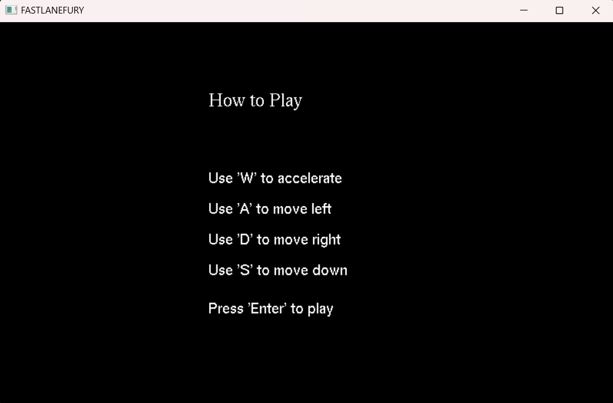
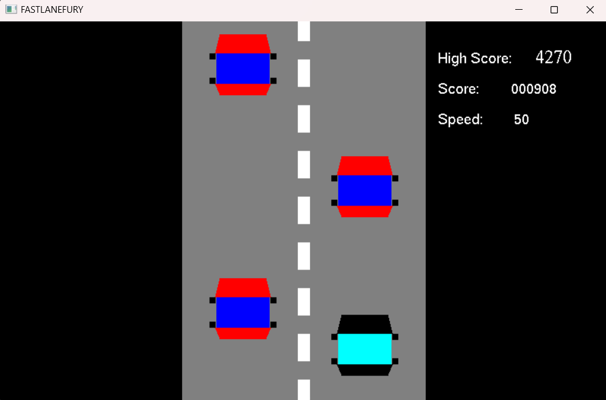
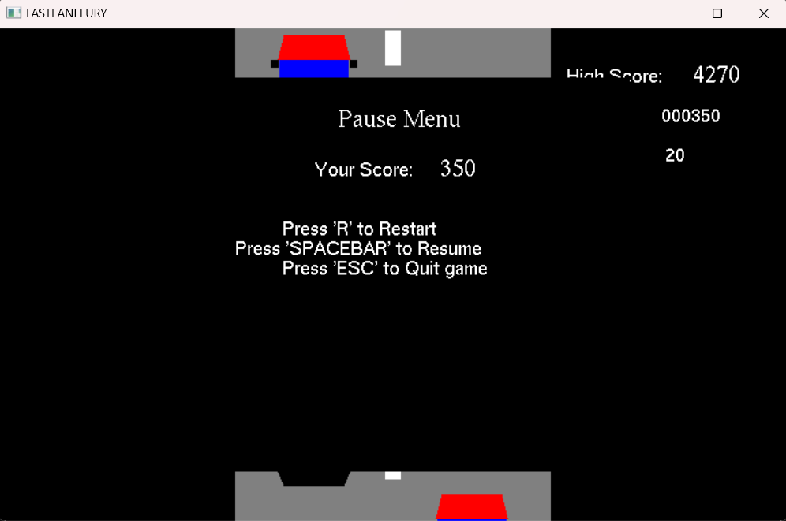

# FastLaneFury

Welcome to the FastLaneFury! Experience the thrill of high-speed racing, dodge obstacles, and compete for the highest score. Get ready for an adrenaline-pumping journey on the virtual road.

## Table of Contents
- [Features](#features)
- [Controls](#controls)
- [How to Play](#how-to-play)
- [Screenshots](#screenshots)
- [Installation](#installation)
- [Dependencies](#dependencies)
- [Contributing](#contributing)
- [License](#license)

## Features

- **High-Speed Racing:** Navigate through traffic and dodge obstacles as you strive for the highest score.
- **Dynamic Speed:** The game speed increases as your score rises, providing a challenging experience.
- **Pause Menu:** Pause the game at any time and access the in-game menu to resume, restart, or exit.

## Controls

- **Accelerate (Up):** W
- **Move Left:** A
- **Move Right:** D
- **Decelerate (Down):** S
- **Pause/Resume:** Spacebar
- **Restart (During Pause):** R
- **Quit Game (During Pause):** ESC

## How to Play

1. Press any key to start the game.
2. Accelerate, dodge obstacles, and increase score.
3. Use the in-game pause menu to pause, resume, or restart the game.
4. Compete for the highest score and challenge your friends!

## Screenshots

## Installation

1. Clone the repository:

git clone https://github.com/Rishiponnam/FastLaneFury.git

cd FASTLANEFURY

2. How to run:

After cd FASTLANEFURY,just run the file using command 

g++ -o car_racing car_racing.cpp -lfreeglut -lglu32 -lopengl32 -lglew32

And execute the file using ./car_racing.exe

## Dependencies
OpenGL
GLUT (OpenGL Utility Toolkit), MingW
Make sure to install the necessary dependencies before running the game.

## Contributing
Contributions are welcome! If you find any issues or have suggestions for improvement, feel free to open an issue or submit a pull request.

## License
This project is licensed.

Happy Racing!
